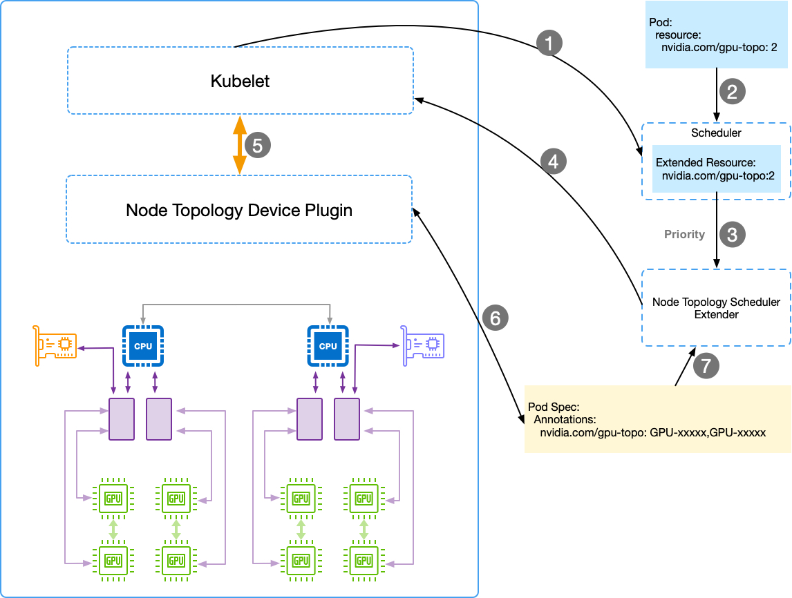
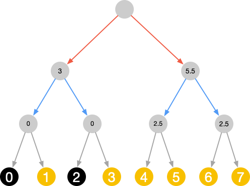

# GPU topology device plugin for kubernetes

## Architecture



## Workflow

1. GPU topology device plugin register the GPU device list and construct the topology information, update the topology info on that node's annotation;
2. Kubelet report the resource info which got from resource device plugin to the default scheduler;
3. A pod with the resource named `nvidia.com/gpu-topo` will go into default scheduler;
4. After filter, predict and priority function of default scheduler, it will send the priority, filtered node list;
5. The node topology scheduler extender will select the best pod from node list based on topology which gets from node's annotation:
  * The NVidia GPU card request is `1`: Set the node which has odd NVidia GPU cards as higher score;
  * The NVidia GPU card request is more than `1`: Set the node's score based on average link score for unused every two NVidia GPU cards;
And then, send the pod request to that node.
6. Kubelet get the pod request and allocate the resources, the GPU topology device plugin will do the real allocation for the request:
  * Based on the topology information and connect link type, get the average link score of the current branch
  * Based on the topology, score and request GPU cards number
      * Select the higher average link score for more than 1 GPU cards
      * Select the Lower average link score for 1 GPU cards
  * Add the real GPU cards to the AllocationResponse with `NVIDIA_VISIBLE_DEVICES`, keep the mapping of kubelet requested device to the real allocated device
  * Keep watch the pod's state, and get the kubelet's checkpoint file when the pod is running
  * Based on the logged device ID, find PodUID, update the pods' annotation
7. Update the pod's annotation for the real GPU devices
8. Node topology scheduler extender get the pod's annotation and used GPU cards

## Example

### Select best two GPU cards on single machine

Assume we have the follow machine with eight GPU cards and constructed the device tree:
  


```
# nvidia-smi topo -m
	GPU0	GPU1	GPU2	GPU3	GPU4	GPU5	GPU6	GPU7
GPU0	 X 	PIX	PHB	PHB	SYS	SYS	SYS	SYS
GPU1	PIX	 X 	PHB	PHB	SYS	SYS	SYS	SYS
GPU2	PHB	PHB	 X 	PIX	SYS	SYS	SYS	SYS
GPU3	PHB	PHB	PIX	 X 	SYS	SYS	SYS	SYS
GPU4	SYS	SYS	SYS	SYS	 X 	PIX	PHB	PHB
GPU5	SYS	SYS	SYS	SYS	PIX	 X 	PHB	PHB
GPU6	SYS	SYS	SYS	SYS	PHB	PHB	 X 	PIX
GPU7	SYS	SYS	SYS	SYS	PHB	PHB	PIX	 X 

Legend:

  X    = Self
  SYS  = Connection traversing PCIe as well as the SMP interconnect between NUMA nodes (e.g., QPI/UPI)
  NODE = Connection traversing PCIe as well as the interconnect between PCIe Host Bridges within a NUMA node
  PHB  = Connection traversing PCIe as well as a PCIe Host Bridge (typically the CPU)
  PXB  = Connection traversing multiple PCIe switches (without traversing the PCIe Host Bridge)
  PIX  = Connection traversing a single PCIe switch
  NV#  = Connection traversing a bonded set of # NVLinks
```

Based on the topology and link type, we make the score for each branch. So the selection of GPU cards can be did with them as:

* Select the lower score branch if the requested GPU number is 1
* Select the higher score branch if the requested GPU number is more than 1

### Select best node from the cluster

TBD
